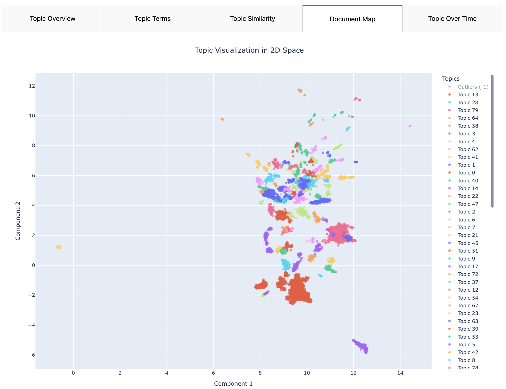

# Trustpilot Reviews Analysis Dashboard

This repository contains an end-to-end pipeline to scrape, process, and analyze customer reviews from **Trustpilot** for a given company. The processed data is visualized in an interactive dashboard built with **Dash**, which dynamically updates every 50 seconds if new data is detected in the `full_reviews.csv` file.

The pipeline is orchestrated using **Apache Airflow** running in a Docker container, and the Dash dashboard also runs in its own Docker container.

---

## Table of Contents

1. [Overview](#overview)
2. [Project organization](#project-organization)
3. [Dashboard Features](#dashboard-features)
4. [Pipeline Workflow](#pipeline-workflow)
5. [Dashboard Screenshots](#dashboard-screenshots)
6. [Topic Modeling Dashboard Screenshots](#topic-modeling-dashboard-screenshots)
7. [Installation and Setup](#installation-and-setup)
8. [Usage](#usage)
9. [License](#license)

---

## Overview

The project automates the collection and analysis of customer reviews from Trustpilot. It performs the following tasks:

1. **Scraping**: Extracts review data (text, sentiment, rating, date, etc.) from Trustpilot.
2. **Processing**: Cleans and processes the scraped data to derive insights such as sentiment analysis and temporal features.
3. **Loading**: Saves the processed data into a CSV file (`full_reviews.csv`).
4. **Visualization**: Provides a Dash-based dashboard that dynamically updates every 50 seconds if new data is available.

The pipeline is scheduled using **Apache Airflow**, ensuring regular updates to the dataset and dashboard.

---

## Project Organization

```bash
├── airflow
│   ├── dags
│   │   ├── config.py
│   │   ├── config.yaml
│   │   ├── review_manager.py
│   │   └── review_pipeline.py
│   ├── Dockerfile
│   └── requirements.txt
│ 
├── dashboard
│   ├── app.py
│   ├── Dockerfile
│   └── requirements.txt
│ 
├── data
│   ├── archive
│   ├── cleaned
│   ├── full
│   ├── raw
│   └── results
│ 
├── notebooks
│   ├── reviews_dashboard.ipynb
│   ├── reviews_dataviz.ipynb
│   └── reviews_extraction.ipynb
│
├── topic_modeling
│   ├── config.yaml
│   ├── main.py
│   ├── Dockerfile
│   └── requirements.txt
│
├── parameters
│   └── max_page.txt
│ 
├── docker-compose.yaml
├── readme.md
├── requirements.txt
├── setup.sh
```

### Project Tree Description

This is the structure of a project designed to scrape, process, and analyze customer reviews from **Trustpilot** for a given company. The project includes an **Apache Airflow pipeline** for orchestrating data workflows, a **Dash-based dashboard** for visualizing insights, and supporting files for development and deployment. Below is a detailed description of each component in the tree:

---

#### **Root Directory**

- **`docker-compose.yaml`**:
  - Defines the Docker Compose configuration for running the entire project, including Airflow and the Dash dashboard.

- **`readme.md`**:
  - Documentation file describing the project, its features, installation steps, and usage instructions.

- **`requirements.txt`**:
  - Lists Python dependencies required for the project (used outside Docker containers).

- **`setup.sh`**:
  - A shell script to initialize necessary directories and parameters for the project. Must be executed with appropriate permissions.

---

#### **`airflow/`**
This directory contains all files related to the Apache Airflow pipeline.

- **`Dockerfile`**:
  - Defines the Docker image for Airflow, including customizations like additional dependencies or configurations.

- **`dags/`**:
  - Contains the Directed Acyclic Graphs (DAGs) that define the Airflow workflows. Each DAG represents a pipeline step (e.g., scraping, processing, loading reviews).

- **`requirements.txt`**:
  - Lists Python dependencies specific to the Airflow environment and the reviews pipeline (e.g., `apache-airflow`, `pandas`, `nltk`).

---

#### **`dashboard/`**
This directory contains all files related to the Dash-based dashboard.

- **`Dockerfile`**:
  - Defines the Docker image for the Dash app, including dependencies and configurations.

- **`app.py`**:
  - The main Python script for the Dash app. It defines the layout, callbacks, and interactivity of the dashboard.

- **`requirements.txt`**:
  - Lists Python dependencies required for the Dash app (e.g., `dash`, `plotly`, `pandas`, `wordcloud`).

---

#### **`data/`**
This directory organizes all data used in the project.
will be created after running the setup script and the pipeline.
- **`archive/`**:
  - Stores archived versions of processed data (e.g., older datasets for historical analysis).

- **`cleaned/`**:
  - Contains cleaned and processed review data ready for analysis.

- **`full/`**:
  - Stores the final dataset (`full_reviews.csv`) used by the Dash dashboard for visualization.

- **`raw/`**:
  - Contains raw, unprocessed data scraped from Trustpilot.

- **`results/`**:
  - Contains saved trained bertopic models.
---

#### **`notebooks/`**
This directory contains Jupyter notebooks for exploratory data analysis, development, and testing.

- **`reviews_dashboard.ipynb`**:
  - Notebook for prototyping and testing the Dash dashboard's visualizations.

- **`reviews_dataviz.ipynb`**:
  - Notebook for exploring and visualizing review data (e.g., sentiment analysis, trends).

- **`reviews_extraction.ipynb`**:
  - Notebook for testing and debugging the scraping and data extraction process.

---

#### **`topic_modeling/`**
This directory contains all files related to the Dash-based dashboard.

- **`Dockerfile`**:
  - Defines the Docker image for the bertopic topic modeling, including dependencies and configurations.

- **`main.py`**:
  - The main Python script for the bertopic model training and the dashboard to visualize bertopic model's performance and topics.

- **`requirements.txt`**:
  - Lists Python dependencies required for bertopic and the the bertopic model's performance and topics dashboard.

---

## Dashboard Features

The dashboard provides the following features:

### **1. Filters**
- Filter reviews by year, quarter, and month.

### **2. Overall Overview Tab**
- **Sentiment Distribution**: Pie chart showing the distribution of positive, neutral, and negative sentiments.
- **Rating Distribution**: Bar chart displaying the distribution of ratings (1–5 stars).
- **Reply Rate Trend**: Percentage of reviews with replies over time.
- **Yearly Review Volume and Average Rating**: Table summarizing yearly review volume and average ratings.

### **3. Trends Tab**
- **Review Volume Trends**: Line chart showing review volume trends (daily, monthly, quarterly, yearly).
- **Sentiment Trends**: Sentiment trends over time.
- **Average Rating Trends**: Average rating trends over time.

### **4. Textual Analysis Tab**
- **Word Cloud**: Visualization of the most frequent words for the selected sentiment (positive, neutral, negative).
- **Top N-Grams**: Table displaying the top 10 trigrams (groups of three consecutive words) for the selected sentiment.

### **5. Export Functionality**
- Export filtered data as a CSV file for offline analysis.

---

## Pipeline Workflow
*Airflow graph*


*Pipeline tasks in Airflow*


The pipeline is orchestrated using **Apache Airflow** and consists of the following steps:

1. **Extract Reviews**:
   - Scrapes customer reviews from Trustpilot.
   - Outputs raw review data.

2. **Process Reviews**:
   - Cleans and transforms raw review data.
   - Adds derived features such as sentiment labels, year, quarter, and month.

3. **Load Reviews**:
   - Saves the processed data into `full_reviews.csv`.

4. **Check Bertopic Container Task**:
   - Checks if the bertopic container is currently running. If it is, the container is stopped and removed to enable the creation and launch of a new instance of the container for the next bertopic training round, incorporating the updated reviews data.
  
5. **Toic Modeling Task**:
   - Train a BERTopic model on updated reviews data. Save the trained model. Calculate coherence scores and diversity score for the model. Update the topic modeling dashboard with the coherence scores, diversity score, and visualizations of the topics.

**Dynamic Dashboard Updates**:
   - The dashboard checks `full_reviews.csv` every 50 seconds for updates.
   - If new data is detected, the dashboard reloads and refreshes the visualizations.

---

## Dashboard Screenshots

### **Reviews Dashboard**

#### Overview Tab

*The Overview Tab displays key metrics including sentiment distribution, rating distribution, and reply rate trends.*

#### Trends Tab

*The Trends Tab visualizes how review volume, sentiment, and average ratings change over time.*

#### Textual Analysis Tab

*The Textual Analysis Tab features a word cloud and top n-grams for selected sentiment categories.*

#### Filtering and Export
*Users can filter the data by time period and export the filtered dataset for further analysis.*

---

## Topic Modeling Dashboard Screenshots

### **BERTopic Visualization**

Below are some screenshots of the interactive dashboard generated by the pipeline. These visuals provide insights into the topics extracted from customer reviews and their relationships.

#### **0. Dashboard Overview**
Overall view of the dashboard layout


#### **1. Topic Overview**
This tab provides a high-level summary of the identified topics, including their sizes and names.


#### **2. Top Terms Per Topic**
A bar chart displaying the top terms for each topic, highlighting the most representative words.


#### **3. Topic Similarity**
Heatmap matrix indicating how similar certain topics are to each other


#### **4. Document Map**
A 2D visualization of the topics and their associated documents. Each point represents a document, colored by its assigned topic.


#### **5. Topic Over Time**
A visualization of frequency of topics over time


---

## Installation and Setup

### Prerequisites
- **Docker** and **Docker Compose** installed on your system.
- Python 3.11 (for local development or custom scripts).

### Steps

1. **Clone the Repository**:
   ```bash
   git clone https://github.com/your-repo/trustpilot-reviews-analysis.git
   cd trustpilot-reviews-analysis
   ```

2. **Run the `setup.sh` Script**:
   - Ensure the `setup.sh` script has execute permissions:
     ```bash
     chmod +x setup.sh
     ```
   - Execute the script to initialize the `data` and `parameters` folders:
     ```bash
     ./setup.sh
     ```

3. **Update the configuration file for reviews extraction and processing**
The current config.yaml file is configured to extract reviews from Backmarket's Trustpilot page. You can modify this configuration to target any other company available on Trustpilot by following these steps:
- Open the config.yaml file located in the airflow/dags/ directory
- Locate the URL parameter that points to Backmarket's Trustpilot page
- Replace it with the Trustpilot URL of your desired company
- Adjust any company-specific parameters as needed (such as max pages to scrape, stop words to add)
```bash
company_name: "backmarket"
base_url: "https://fr.trustpilot.com/review/www.{company_name}.fr"

paths:
  base_dir: "."
  parameters_dir: "{base_dir}/parameters"
  data_dir: "{base_dir}/data"
  logs_dir: "{base_dir}/logs"
  raw_data_dir: "{data_dir}/raw"
  cleaned_data_dir: "{data_dir}/cleaned"
  full_reviews_dir: "{data_dir}/full"
  archive_dir: "{data_dir}/archive"

files:
  max_page_param_file: "{parameters_dir}/max_page.txt"
  log_file: "{logs_dir}/reviews_pipeline.log"

http_headers:
  User-Agent: "Mozilla/5.0 (Windows NT 10.0; Win64; x64) AppleWebKit/537.36 (KHTML, like Gecko) Chrome/91.0.4472.124 Safari/537.36"
  Accept: "text/html,application/xhtml+xml,application/xml;q=0.9,image/webp,*/*;q=0.8"
  Accept-Language: "en-US,en;q=0.5"
  Connection: "keep-alive"
  Upgrade-Insecure-Requests: "1"
  Cache-Control: "max-age=0"

request_settings:
  timeout: 10
  retry_count: 3
  retry_delay: 2
  max_pages_to_scrape: 10
  delay_between_requests: 1

review_keys:
  - "id"
  - "title"
  - "review"
  - "rating"
  - "reply"
  - "experienceDate"
  - "createdDateTime"
  - "publishedDate"
  - "replyPublishedDate"

stop_words_to_add:
  - "être"
  - "leur"
  - "leurs"
  - "avoir"
  - "cela"
  - "les"
  - "de"
  - "pour"
  - "des"
  - "cette"
  - "a"
  - "j'ai"
  - "car"
  - "c'est"
  - "chez"
  - "tout"
  - "fait"
  - "chez"
  - "donc"
  - "n'est"
  - "si"
  - "alors"
  - "n'ai"
  - "faire"
  - "deux"
  - "comme"
  - "jour"
  - "tr"
  - "si"
  - "ue"
  - "back"
  - "backmarket"
  - "market"

min_review_length: 4

sentiment_thresholds:
  positive: 4
  neutral: 3
  negative: 2

spacy_model: "fr_core_news_sm"
```

4. **Configuring BERTOpic Model Training**
The current config.yaml file in the topic modeling directory is configured to train a BERTopic model specifically on full reviews. You can customize this configuration to analyze different review segments or modify model parameters for optimal performance.

***Changing the Review Dataset***

- Open the config.yaml file located in the topic_modeling/ directory
- Locate the input_filepath parameter in the configuration
- Choose from one of the following dataset options based on your analysis needs:
    - data/full/full_reviews.csv - Train on the complete dataset of all reviews (current setting)
    - data/full/negative_reviews.csv - Focus on negative reviews only
    - data/full/neutral_reviews.csv - Analyze neutral sentiment reviews
    - data/full/positive_reviews.csv - Explore patterns in positive reviews

***Fine-tuning Model Parameters***

You can enhance model performance by adjusting these key parameters:

```bash
data:
  input_filepath: "/data/full/full_reviews.csv"  # Path to the CSV file
  review_column: "review_lemmatized"  # Column name for reviews
  timestamps_column: "yearMonth"  # Column name for timestamps
  sample_size: null  # Optional: Number of reviews to sample. Use null for all data 

model:
  # Core model configuration
  transformer_name: "all-MiniLM-L6-v2"  # Base embedding model
  language: "french"
  min_topic_size: 20
  nr_topics: "auto"
  top_n_words: 15
  # Dimensionality reduction
  umap:
    n_neighbors: 15
    n_components: 3
    min_dist: 0.0
    metric: "cosine"
    random_state: 42
  # Clustering parameters
  hdbscan:
    min_cluster_size: 20
    metric: "euclidean"
    cluster_selection_method: "eom"
    prediction_data: true
  # text vectorization parameters (used for keyword extraction)
  vectorizer:
    stop_words: None
    ngram_range: [1, 2] # Extract both unigrams and bigrams for better topic representation

evaluation:
  coherence_metrics:    # Coherence metrics to calculate
    - "c_v"  # Coherence Measure V
    - "u_mass"  # UMass Coherence
    - "c_npmi" # Normalized Pointwise Mutual Information

output:
  save_model: true   # Whether to save the trained model
  output_dir: "/data/results"  # Directory to save model outputs

dashboard:
  port: 8050  # Port for the dashboard  
  host: "0.0.0.0"
  debug: True
```

5. **Build and Launch Docker Containers**:
   - Use the provided `docker-compose.yml` file to launch Airflow, the Dash dashboard, the bertopic container and other dependencies:
     ```bash
     docker-compose up --build
     ```
   - This will start the following services:
     - **Airflow Webserver**: Accessible at `http://localhost:8080`.
     - **Airflow Scheduler**: Handles DAG execution.
     - **PostgreSQL**: Database for Airflow metadata.
     - **Redis**: Message broker for CeleryExecutor.
     - **Dash Dashboard**: Accessible at `http://localhost:8050`.
     - **BERTopic Container**: Model training and Topic Modeling Dashboard

6. **Access the Reviews Dashboard**:
   - Once the containers are running, open the Dash app in your browser:
     ```bash
     http://localhost:8050
     ```

7. **Access Airflow**:
   - Open the Airflow web interface in your browser:
     ```bash
     http://localhost:8080
     ```
   - Default credentials:
     - Username: `airflow`
     - Password: `airflow`

8. **Access the Topic Modeling Dashboard**:
   - Once the bertopic model is trained, model perfomance and topic modeling visualization are available on a Dash dashboard through you brower at the address:
     ```bash
     http://localhost:8060
     ```

---

## Usage

1. **Trigger the Pipeline**:
   - Trigger the Airflow DAG manually or wait for the scheduled run.

2. **View the Reviews Dashboard**:
   - Open the Dash app in your browser to explore the latest reviews and insights.
   - Use the export button on the dashboard to download filtered data for further analysis.

3. **View the Topic Modeling Dashboard**:
   - Open the Topic Modeling Dash app in your browser to explore the the bertopic model perfomance and to visualize topics.

---

## License

This project is licensed under the MIT License. See the [LICENSE](LICENSE.md) file for details.

---

Feel free to reach out with any questions or suggestions! 🚀